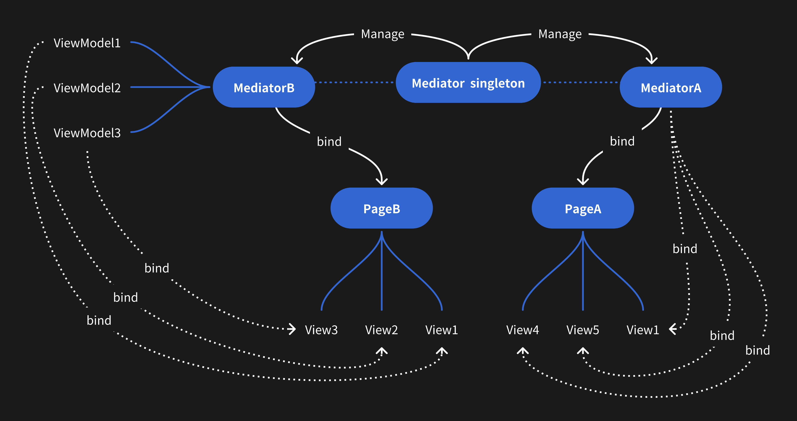

# ⭐️⭐️⭐️If you find it helpful,please star, I need it ⭐️⭐️⭐️

[简体中文](./chinese.md) English

# MVMDemo
h5,iOS,Android, software architecture, MVM (Mediator, View, ViewModel)

The design was originally conceptualized following the principles of MVM (Mediator, View, ViewModel). Upon completion, I conducted an online search to identify similar approaches. Eventually, `Page Object Model, also known as POM, is a design pattern in Selenium that creates an object repository for storing all web elements.` However, In iOS, Android, and H5, I have not yet found design pattern related to this aspect.

### I. Introduction to MVM
**At its core, it functions as an intermediary between the backend and the UI. It sends requests to the backend for interface data, parses the data, and produces a data model suitable for the UI's requirements, encompassing both `data` and `function` components. The frontend then directly renders this model, freeing UI developers from the need to address the underlying logic. Simultaneously, logic developers are liberated from focusing on UI concerns.**

button, button text and button click function, eg.

```
class BtnModel {
    let text = "login"
    function clickFunc(){
    // click login...
    }
}

let btn = Button()
let model = BtnModel()

btn.text <--> model.text // bind
btn.click = function() {
   model.clickFunc()
}
// UI developers can directly use the data obtained, while logic developers only need to focus on logic without concerning themselves with UI.
```


` start ` in [demo](https://github.com/AblerSong/MVMDemo), simple code, beginner developers can easily understand
implementation:https://github.com/AblerSong/MVMDemo




### II. Code Implementation


UI: 1.username;2.password;3.login button

backend data

```
var backendData = {
  username_label: "username",
  password_label: "password",
  login_label: "login",
}
```

frontend Mediator
```
class MediatorA {
  constructor() {
    this.username_label = backendData.username_label
    this.username = ""
    this.password_label = backendData.password_label
    this.password = ""
    this.login_label = backendData.login_label
  }
  login_func() {
    if (this.username?.length == 0) {
      Toast("input username")
      return
    }
    // login code ...
  }
}

// The frontend interface renders and performs bidirectional binding through this data.
var mediator = new MediatorA()
```

or frontend Mediator
```
class MediatorB {
  constructor() {
    this.username = new InputViewModel()
    this.username.label = backendData.username_label

    this.password = new InputViewModel()
    this.username.password = backendData.password_label

    this.login = new ButtonViewModel()
    this.login.label = backendData.login_label
    this.login.clickFunc = () => {
      this.login_func()
    }

    // The frontend interface renders and performs bidirectional binding through this data.
    this.renderList = [
        {module:InputView, viewModel: this.username},
        {module:InputView, viewModel: this.password},
        {module:ButtonView, viewModel: this.login}
    ]
  }
  login_func() {
    if (this.username.text.length == 0) {
      Toast("input username")
      return
    }
    // login code ...
  }
}
```


### III. Design Approach

- Create a Page `(iOS: ViewController; Android: Activity or fragment; Vue:.vue)`
- Divide the page UI into different components, with each component corresponding to a `ViewModel`. UI text is defined as a variable within the `ViewModel`, while UI click events are defined as closures.
- Establish a `Mediator` that, upon completion of the API request, initializes all `ViewModel` variables and closures based on the data returned from the backend. Refer to [IV. Code Implementation](#IV. Code Implementation) for specific details.
- Provide the `Mediator` to UI developers, who can directly bind and render the UI based on the data contained within the `Mediator`.


### IV. Specific Implementation and Detailed Requirements (Reference Solution)

- ##### Split each page into separate `PageMediator` instances, following the division of pages.
- ##### Divide a page into different components based on "rows", where each component corresponds to a specific `ViewModel`, all managed through the `PageMediator`.
- ##### Utilize a `MediatorManager Singleton` for each `PageMediator` (in the H5 demo, can use `Vuex`). This approach ensures data is keep alive, whereas UI elements are not keep alive.

**`MediatorManager Singleton` manages `PageMediators`, and each `PageMediator` manages `ViewModels`** as outlined below:

```
MediatorManager.getSingleton().mediator = new Mediator
MediatorManager.getSingleton().mediator = null
```

- ##### If a page contains numerous components, the `PageMediator` could become complex. In such scenarios, you could utilize appropriate `design patterns` to refactor the `PageMediator`. The specific approach to splitting depends on individual preferences and architectural capabilities.

- ##### **It's crucial to carefully consider `public` `variables` and `methods` within `PageMediator`.** As long as the exposed API for UI is sound, subsequent logic refactoring won't impact the UI, and altering the UI will have minimal effect on the logic.

- ##### In practical development, other modules should also be encapsulated to facilitate future use of `Unit Test` as a replacement for `UI Test`. For instance, modules like Router, Toast, and Network. For example, for `Toast`:

```
class ToastViewModel {
    // use ReactiveX replace setter
    set toast(value) {
        Toast(value)
    }
}
```

### V. Advantages and Disadvantages

Advantages:

- Compared to frameworks like VIPER, MVI, etc., the core idea is simpler and easier to grasp.
- Separation of UI and logic facilitates task decomposition and combination, enhancing code reusability.
- Properly decomposed, the `Mediator` can be `unit test` in place of `UI test`; **this facilitates straightforward white-box automated testing**.
- Thanks to the presence of the `MediatorManager Singleton`, data remains alive, while UI doesn't; data is centralized, enabling easy management.
- Uniform business code structure allows developers to quickly take over others' code.

Disadvantages:

- Developers not paying attention can easily cause memory leaks, which may be challenging to locate.

### VI. Conclusion

From a practical development perspective, this framework is exceptionally well-suited for H5 applications. For example, in the demo (Vue), breaking down components into `.vue`, `.scss`, and `.js` files greatly enhances code reusability, particularly due to the independent nature of CSS files.

For H5, iOS, and Android, utilizing the `Mediator` for `Unit test` in place of `UI test` can significantly reduce errors and enhance testing efficiency.

Personally, I am highly impressed with this approach. It substantially boosts the efficiency of automated testing, making UI test much less cumbersome compared to the convenience of Unit test.

