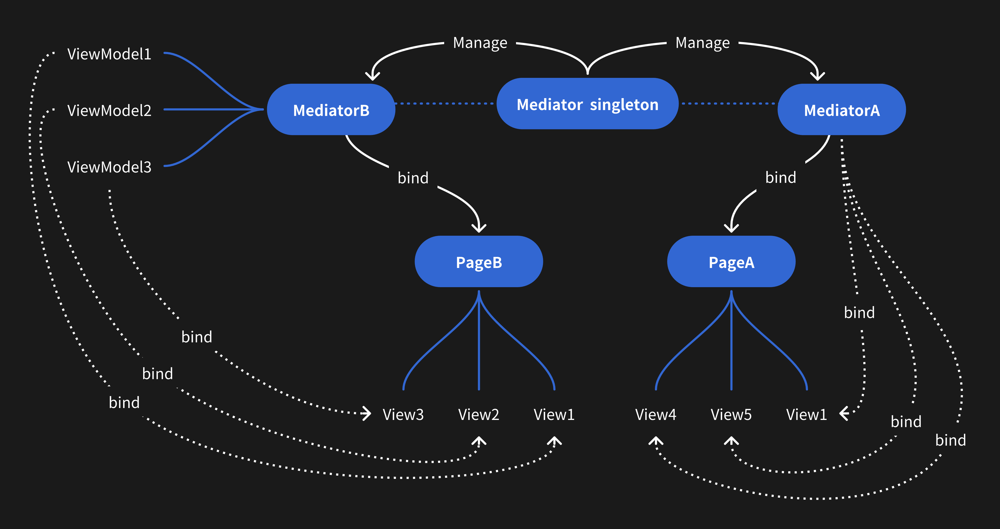

# ⭐️⭐️⭐️如果觉得有帮助,请star ⭐️⭐️⭐️

简体中文 [English](./README.md)
# MVMDemo
MVM设计模式 for iOS, Android, H5; 大前端的POM设计模式


设计之初是按照MVM(Mediator, View, ViewModel)的思路设计的,完成后搜索了一下网上有没有类似思路, 最后发现了`Page Object Model, also known as POM, is a design pattern in Selenium that creates an object repository for storing all web elements.`; 在iOS, Android, H5中还没搜到这方面的文章


##### 一、MVM简介
**本质上就是一个后端和UI的中间件, 向后端请求接口之后对数据解析, 输出一个UI需要的且可以直接使用的数据模型(包含`data`和`function`),前端直接渲染, UI开发无需关注逻辑,逻辑开发者无需关注UI;**

比如一个button,有登录文字和点击事件, 下面是伪代码

```
class BtnModel {
    let text = "登录"
    function clickFunc(){
    // 点击登录
    }
}

let btn = Button()
let model = BtnModel()

btn.text <--> model.text//这里进行绑定
btn.click = function() {
   model.clickFunc()
}
// UI开发拿到数据可以直接绑定界面需要显示的文字, 点击事件, 逻辑开发者只需关注逻辑无需关注UI
```

[demo](https://github.com/AblerSong/MVMDemo)中的`  start ` 入门版代码简单易懂,初级开发也能快速上手;具体实现请点击https://github.com/AblerSong/MVMDemo


**架构图如下:**


##### 二、代码实现(比如实现如下功能)


登录界面有: 1.用户名;2.密码;3.登录按钮

后端返回的数据格式如下

```
var backendData = {
  username_label: "username",
  password_label: "password",
  login_label: "login",
}
```

经过前端处理得到的Mediator如下
```
class MediatorA {
  constructor() {
    this.username_label = backendData.username_label
    this.username = ""
    this.password_label = backendData.password_label
    this.password = ""
    this.login_label = backendData.login_label
  }
  login_func() {
    if (this.username?.length == 0) {
      Toast("input username")
      return
    }
    // login code ...
  }
}

// UI层通过使用这个 直接渲染绑定
var mediator = new MediatorA()
```

或者经过前端处理得到的Mediator如下
```
class MediatorB {
  constructor() {
    this.username = new InputViewModel()
    this.username.label = backendData.username_label

    this.password = new InputViewModel()
    this.username.password = backendData.password_label

    this.login = new ButtonViewModel()
    this.login.label = backendData.login_label
    this.login.clickFunc = () => {
      this.login_func()
    }

    // UI层通过使用这个数组 直接渲染绑定
    this.renderList = [
        {module:InputView, viewModel: this.username},
        {module:InputView, viewModel: this.password},
        {module:ButtonView, viewModel: this.login}
    ]
  }
  login_func() {
    if (this.username.text.length == 0) {
      Toast("input username")
      return
    }
    // login code ...
  }
}
```


##### 三、设计思路
- 创建一个Page `(iOS: ViewController; Android: Activity or fragment; Vue:.vue)`
- 将页面UI拆分不同组件, 每个组件对应一个 `ViewModel`, UI文字定义为 `ViewModel` 变量, UI点击事件定义成 `ViewModel` 闭包,
- 创建一个 `Mediator`, 接口请求完成后, 根据后端返回的数据,初始化所有 `ViewModel` 的变量和闭包; 具体看 [四、代码实现](#四、代码实现)
- 将`Mediator`给UI开发者, 直接根据`Mediator`中的数据进行绑定渲染即可


##### 四、具体实现和细节要求(方案参考)
- 1.按照页面拆分,每个页面有一个 `PageMediator`
- 2.将一个页面按照`行`拆分成不同组件, 每种组件对应一种 `ViewModel`, 通过 `PageMediator` 管理
- 3.每个 `PageMediator` 通过 `MediatorManager Singleton` (demo中h5用 `Vuex` 替代); 这样的话所有的数据 keepAlive; UI没有 keepAlive
&emsp; **`MediatorManager Singleton` 管理 `PageMediator`, `PageMediator` 管理 `ViewModel`**  如下:


```
MediatorManager.getSingleton().mediator = new Mediator
MediatorManager.getSingleton().mediator = null
```


- 4.当一个页面组件非常多的时候, `PageMediator` 肯定会非常复杂; 这个时候可以通过 `design pattern` 对 `PageMediator` 进行拆分; 具体拆分看个人习惯和架构能力
- 5.**`PageMediator` 的 `public` `变量` 和 `方法` 一定要深思熟虑**, 如果 `PageMediator` 封装不是很好, 只要对UI暴露的 api 没问题; 后续重构逻辑不会影响UI, 同样修改UI对逻辑影响很小
- 6.实际开发中还需要封装其他模块, **方便后期使用 `Unit Test` 替代 `UI Test`**; 比如Router, Toast, Network等, e.g.Toast:

```
class ToastViewModel {

    // 在 setter 中 进行Toast, 可以做到全局处理, 后期可以根据 变量值 进行 Unit Test
    // 实际开发中建议使用 Rx 系列框架
    set toast(value) {
        Toast(value)
    }
}
```


##### 五、优缺点

优点 :

- 相比VIPER, MVI 等框架, 核心思想简单, 方便理解
- UI 和 逻辑拆分, 方便任务拆解组合, 提高代码复用性
- 理论上拆解合适, 可以通过对 `Mediator` 进行 `unit test` 替代 `UI test`; **非常容易进行白盒自动化测试**
- 由于 `MediatorManager Singleton` 存在; 相当于所有的数据 keepAlive; UI没有keepAlive; 数据唯一, 方便管理
- 业务代码结构统一, 开发人员可以快速接手其他人的代码

缺点 :

- 开发者不注意容易内存泄露,且不易定位

##### 六、总结

从实际开发来看, 该框架非常非常适合h5; 比如demo(vue)中拆分成`.vue`, `.scss`, `.js`; 由于css文件的独立性, 极大的提高了代码的复用率;

对于h5,iOS和Android, 可以通过 `Mediator` 进行 `Unit test` 替代 `UI test`, 减少错误提高测试效率;

本人非常喜欢, 可以大幅提高自动化测试效率, 写UI Test太麻烦,还是 Unit Test方便;
